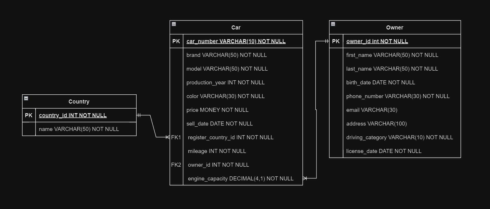

# Cars-Owners-Database-Management
_Лабораторная работа №2.1, 2.2. Шрубок Анна Владимировна 11 группа 3 курс 2024_

# Описание
База данных предназначена для управления информацией о автомобилях и их владельцах.
Она состоит из двух основных справочников: Автомобили (Cars) и Владельцы (Owners). 

Структура базы данных позволяет эффективно отслеживать и управлять правами владения транспортными средствами, предоставляя полное представление о деталях каждого владельца и автомобилях, 
которые они имеют.

## Схема базы данных

## Таблица `Car`

| **Поле**               | Тип данных      | Описание                                               |
|------------------------|-----------------|--------------------------------------------------------|
| `car_number`           | VARCHAR(10)     | Уникальный номер автомобиля (PK)                       |
| `brand`                | VARCHAR(50)     | Марка автомобиля                                       |
| `model`                | VARCHAR(50)     | Модель автомобиля                                      |
| `production_year`      | INT             | Год выпуска                                           |
| `color`                | VARCHAR(30)     | Цвет автомобиля                                        |
| `price`                | MONEY           | Цена автомобиля                                        |
| `engine_capacity`      | DECIMAL(4, 1)   | Объем двигателя в литрах                               |
| `sell_date`            | DATE            | Дата продажи автомобиля                                |
| `register_country_id`  | INT             | Идентификатор страны регистрации (FK на таблицу Country, связь многие к одному) |
| `owner_id`             | INT             | Идентификатор владельца (FK на таблицу Owner, связь многие к одному)        |
| `mileage`              | INT             | Пробег автомобиля                                      |

## Таблица `Owner`

| **Поле**            | Тип данных     | Описание                                               |
|---------------------|----------------|--------------------------------------------------------|
| `owner_id`          | INT            | Уникальный идентификатор владельца (PK)               |
| `first_name`        | VARCHAR(50)    | Имя владельца                                         |
| `last_name`         | VARCHAR(50)    | Фамилия владельца                                     |
| `birth_date`        | DATE           | Дата рождения владельца                               |
| `address`           | VARCHAR(100)   | Адрес владельца                                       |
| `phone_number`      | VARCHAR(30)    | Номер телефона владельца                              |
| `email`             | VARCHAR(30)    | Электронная почта владельца                           |
| `driving_category`   | VARCHAR(10)    | Категория водительских прав                            |
| `license_date`      | DATE           | Дата получения водительских прав                       |

